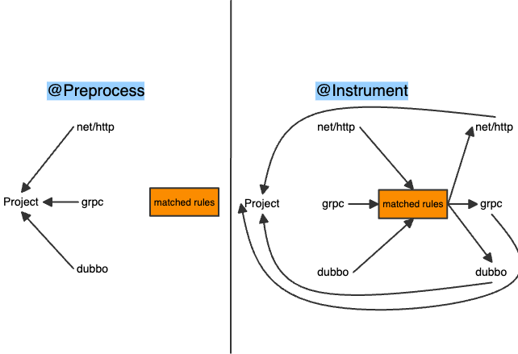

# kotelbuild
[](https://pkg.go.dev/github.com/alibaba/opentelemetry-go-auto-instrumentation#section-readme)

> [!NOTE]
> kotelbuild项目来自于[OpenTelemetry](https://opentelemetry.io/)的开源项目[opentelemetry-go-auto-instrumentation](https://github.com/alibaba/opentelemetry-go-auto-instrumentation)修改而来。
> 该项目是一个Go语言代码插桩工具，用于在编译时期即可自动插入代码。无需修改源代码。

# 它能做什么？
> [!IMPORTANT]
> - 任意方法位置插入前后Hook方法，类似java的AOP
> - 无侵入，平替任意方法的实现
> - 任意结构体中，编译期间插入新字段定义
> - 任意包中，编译期间插入新代码文件

## 修改内容
- [x] 精简项目结构，仅保留核心能力，精简默认`default.json`规则
- [x] 新增`-keepbuilddir`参数，允许用户决定是否保留中间文件，默认自动清理
- [ ] 新增`-unittest`参数，自动生成规则下hook代码单元测试
- [ ] 优化项目metrics上报逻辑
- [ ] 开发可视化idea goland插件工具，方便使用kotelbuild
- [ ] 新增dockerfile，让kotelbuild更容易使用

## 命令概览

```bash
$ .\kotelbuild.exe -help
$ Usage of E:\go-workspace\antgan-0226\otelbuild-demo\kotelbuild.exe:
  -debug
        Enable debug mode, leave temporary files for debugging
  -debuglog
        Print debug log to file
  -in-toolexec
        Run in toolexec mode
  -keepbuilddir
        Keep the .otel-build directory
  -restore
        Restore all instrumentations
  -rule string
        Rule file in json format. Multiple rules are separated by comma
  -verbose
        Print verbose log
  -version
        Print version

```

| 命令      | 作用                                                                                                 |
|---------|----------------------------------------------------------------------------------------------------|
| `debug` | 是否打开调试模式，若开启则会保留所有中间态代码`otel_rules`、`otel_pkgdep`文件夹                                               |
| `debuglog` | 是否打印debug日志                                                                                        |
| `in-toolexec` | go build后面接的参数， 通过`-toolexec`参数，替代`go build`执行                                                     |
| `keepbuilddir` | 是否保留`.otel-build`临时文件夹                                                                             |
| `restore` | 是否生成go build编译后的二进制文件                                                                              |
| `rule`  | 规则文件json路径，多个用,隔开.<br/>默认加载工具默认default.json，如果希望不加载默认规则，则前面加个`+`号。<br/>例如`--rule=+otel_hook/rules.json` |
| `verbose` | 是否打印详细编译过程的日志                                                                                      |
| `version` | 获取工具版本号                                                                                            |


# 快速开始

> 建议golang版本>1.22以上

## 安装工具

拉最新代码，执行`go build`命令打包工具

```bash
$ go build -o kotelbuild.exe main.go
```

## 案例演示

更多案例演示请查看：[otelbuild-demo代码仓库](https://github.com/antgan-0226/otelbuild-demo)

### 例子1：在`net/http::(*Transport).RoundTrip`方法前后添加代码

源代码位置：`net/http/transport.go:530`

```go
// roundTrip implements a RoundTripper over HTTP.
func (t *Transport) roundTrip(req *Request) (_ *Response, err error) {
    t.nextProtoOnce.Do(t.onceSetNextProtoDefaults)
    ctx := req.Context()
    trace := httptrace.ContextClientTrace(ctx)
	//...省略
	
	return
}
```

新建目录`otel_hook/http/hook.go`文件，添加前后钩子hook代码
```go
package http

import (
	"encoding/json"
	"fmt"
	"github.com/antgan-0226/kotelbuild/pkg/api"
	"net/http"
)

func httpClientEnterHook(call api.CallContext, t *http.Transport, req *http.Request) {
	header, _ := json.Marshal(req.Header)
	fmt.Println("[http hook]request header is ", string(header))
}

func httpClientExitHook(call api.CallContext, res *http.Response, err error) {
	header, _ := json.Marshal(res.Header)
	fmt.Println("[http hook]response header is ", string(header))
}

```

新建`otel_hook/rules.json`文件，添加注入规则
```json
[
  {
    "ImportPath":"net/http",
    "Function":"RoundTrip",
    "OnEnter":"httpClientEnterHook",
    "ReceiverType": "*Transport",
    "OnExit": "httpClientExitHook",
    "Path": "otel_hook/http"
  }
]
```

编写测试代码，`main.go`发送http请求
```go
import (
	"context"
	"fmt"
	"net/http"
	"otelbuild-demo/service"
)

func main() {
	//测试net/http::RoundTrip的hook效果
	req, err := http.NewRequestWithContext(context.Background(), "GET", "http://www.baidu.com", nil)
	if err != nil {
		panic(err)
	}
	req.Header.Set("otelbuild", "true")
	client := &http.Client{}
	resp, err := client.Do(req)
	defer resp.Body.Close()

	//测试service::CreateUser的hook效果
	u, _ := service.CreateUser(context.Background(), 1, "test")

	//model.UserModel注入了新字段age
	fmt.Println(fmt.Sprintf("UserModel: %+v", u))
}
```

执行`kotelbuild`命令，代替`go build`编译，并执行
```bash
$ .\kotelbuild.exe --keepbuilddir --rule=+otel_hook/rules.json main.go
$ .\main.exe
```

执行结果如下，说明已经代码已经在编译期间成功注入到RoundTrip方法前后中：
```bash
$ .\main.exe
[http hook]request header is  {"Otelbuild":["true"]}
[http hook]response header is  {"Content-Type":["application/x-gzip"],"Date":["Fri, 22 Nov 2024 03:46:22 GMT"],"Server":["bfe"]}
```

# 原理

> [!NOTE] 
> 更多详情，请查看[原理文档](./docs/how-it-works.md)

简单概括分为两个阶段：`preprocess`和`instrument`，都是在编译期前完成的。

其中`preprocess`阶段主要是对源代码进行预处理，生成规则文件，`instrument`阶段是根据规则文件，对源代码进行插桩。



生成的`TrampolineFunc`（跳板代码）和`HookFunc`（插桩代码），最终通过`compile`命令打包，原理如下：


# Rule规则定义规范

> 请查看[Rule规则定义](./docs/rule_def.md)

# 如何添加新规则

TODO 

# 如何Debug调试插桩代码

TODO 